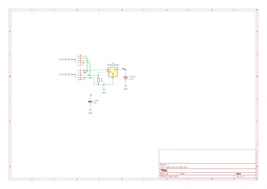
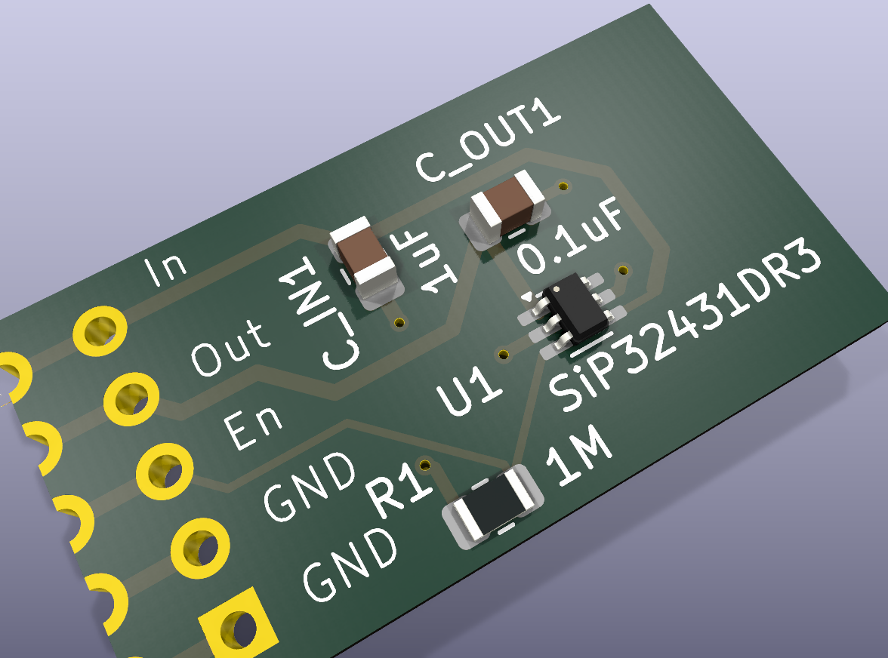

# peripheral-load-switch

Compact SMD peripheral load switch based on the Vishay SiP32431, designed for enabling/disabling power to microcontroller peripherals.

## Description

A minimal, all-SMD load switch board for switching a peripheral's supply voltage under microcontroller control. The design uses the Vishay **SiP32431DR3** high-side switch in a SC-70-6 (SOT-363) package and connects via a 5-pin 2.54 mm half-hole edge connector suited for direct PCB-to-PCB soldering or castellated mounting.

## SiP32431 Key Specifications

| Parameter               | Value                              |
|-------------------------|------------------------------------|
| Operating voltage       | 1.5 V – 5.5 V                      |
| Max continuous current  | 1.2 A                              |
| RDS(on)      | 147 mΩ                             |
| Package                 | SC-70-6 (JEITA) / SOT-363 (JEDEC)  |
| Enable logic            | Active-high                        |
| Switch type             | High-side                          |
| Leakage current         | 10 pA (ultra-low)                  |
| Special features        | Reverse current blocking, soft-start, ultra-low quiescent current |

## PCB & Schematic Features

- All-SMD design; 0805 passives are hand-solderable, SC-70-6 IC requires reflow soldering
- 1 MΩ pull-down on EN pin ensures switch-off when enable is floating
- 1 µF input and 100 nF output decoupling capacitors
- 5-pin 2.54 mm pitch half-hole edge connector (J1) for PCB-to-PCB or castellated mounting
- 5-pin 2.54 mm pitch pin socket (J2, DNP) for development/debug access
- DRC-clean design (0 violations, 0 unconnected pads)
- KiCad 9 source files with custom `Edge_HalfHole_5Pin_2.54mm` footprint included

## Schematic Preview

*Click image to open interactive schematic viewer (KiCanvas)*

## Interactive 3D PCB View

*Click image to open the interactive 3D model viewer (rotate/zoom/pan) — or use [KiCanvas](https://kicanvas.org/?github=https%3A%2F%2Fgithub.com%2Fmatthias-bs%2Fperipheral-load-switch%2Fblob%2Fmain%2Fload_switch.kicad_pcb) for a full PCB layer inspector*

## Bill of Materials

| Ref      | Value       | Footprint        | Description                        | LCSC Part # |
|----------|-------------|------------------|------------------------------------|-------------|
| U1       | SiP32431DR3 | SC-70-6 (SOT-363)| High-side load switch              | [C141606](https://www.lcsc.com/product-detail/C141606.html) |
| R1       | 1 MΩ        | 0805             | Pull-down on EN pin                | [C17514](https://www.lcsc.com/product-detail/C17514.html)  |
| C_IN1    | 1 µF        | 0805             | Input decoupling capacitor         | [C1712](https://www.lcsc.com/product-detail/C1712.html)   |
| C_OUT1   | 100 nF      | 0805             | Output decoupling capacitor        | [C126469](https://www.lcsc.com/product-detail/C126469.html) |
| J1       | —           | Half-hole 5-pin 2.54 mm | Edge connector (IN, OUT, GND, GND, EN) | — |
| J2       | —           | PinSocket 1×5 2.54 mm (DNP¹) | Debug/development header  | — |

> ¹ DNP = Do Not Populate (component is present in schematic/PCB for optional use but not assembled by default)
>
> LCSC Part # are ordering references for [lcsc.com](https://lcsc.com).

## Connector Pinout (J1)

| Pin | Signal | Description          |
|-----|--------|----------------------|
| 1   | GND    | Ground               |
| 2   | GND    | Ground               |
| 3   | EN     | Enable (active-high) |
| 4   | OUT    | Switched output      |
| 5   | IN     | Supply voltage input |

## Production Files

Ready-to-order Gerber files (standard RS-274X, compatible with any PCB fab) are in the [`production/`](production/) folder.

## License

Copyright 2026 Matthias Prinke

`SPDX-License-Identifier: Apache-2.0 WITH SHL-2.1`

Licensed under the [Solderpad Hardware License v2.1](https://solderpad.org/licenses/SHL-2.1/). See [LICENSE](LICENSE) for the full text.
